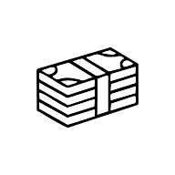

# Cheghad??? - Currency Tracker PWA

A simple and modern **Currency Price Tracker App** built for Iranian users with **Progressive Web App (PWA)** support.  
Cheghad??? helps you quickly check the **latest exchange rates** with real-time updates, so you'll always know the current value of currencies.

---


---



---

##  Features
-  **Live currency updates** (latest exchange rates)
-  **Fast and lightweight** app
-  **PWA Support** - Install as native app
-  **Offline functionality** - Works without internet
-  **Installable** - Add to home screen
-  **Push notifications** - Stay updated
-  **Dark/Light themes** - Automatic system detection

---

##  PWA Features

###  Progressive Web App
- **Installable**: Add to home screen on any device
- **Offline Support**: Works without internet connection
- **Responsive**: Optimized for all screen sizes
- **Fast**: Instant loading with service worker caching
- **Native Feel**: App-like experience

###  Technical Features
- Service Worker for offline functionality
- Web App Manifest for installation
- Background sync capabilities
- Push notification support
- Automatic updates

---

##  Installation

### 1. Clone the Repository
```bash
git clone https://github.com/your-username/cheghad.git
cd cheghad
```

### 2. Install Dependencies
```bash
npm install
```

### 3. Run the Development Server
```bash
npm run dev
```
Now open [http://localhost:3000](http://localhost:3000) in your browser.

### 4. Install as PWA
- Click the "Install App" button in the header
- Or use browser menu: "Add to Home Screen"
- Enjoy native app experience!

---

## Built With
- [Next.js](https://nextjs.org/) – React framework
- [Tailwind CSS](https://tailwindcss.com/) – Styling
- [Shadcn UI](https://ui.shadcn.com/) – Components
- **PWA Technologies** – Service Workers, Web App Manifest
- Currency API (or your own backend for exchange rates)

---

##  Deployment
You can deploy Cheghad??? easily on:
- [Vercel](https://vercel.com/) (recommended)
- [Netlify](https://www.netlify.com/)

---

## PWA Testing

### Chrome DevTools
1. Open DevTools (F12)
2. Go to Application tab
3. Check Service Workers and Manifest

### Lighthouse Audit
```bash
npm run pwa:test
```

---

## Contributing
Contributions, issues, and feature requests are welcome!  
Feel free to fork this repo and submit a Pull Request.

---

## License
This project is licensed under the **MIT License** – free to use, modify, and share.

---

## About
Cheghad??? is made for **Iranian people** who want fast and reliable access to currency exchange rates.  
Simple, useful, always up-to-date, and now with **PWA support** for the best user experience.

---

# چه‌قدر؟؟؟ - ردیاب ارز PWA

اپلیکیشن ساده و مدرن **ردیاب قیمت ارز** ساخته‌شده برای کاربران ایرانی با پشتیبانی **Progressive Web App (PWA)**.  
چه‌قدر؟؟؟ به شما کمک می‌کند تا به‌سرعت **آخرین نرخ ارزها** را با به‌روزرسانی لحظه‌ای بررسی کنید.

---


---

##  امکانات
-  **به‌روزرسانی لحظه‌ای قیمت ارزها**
-  **سبک و سریع**
-  **پشتیبانی PWA** - نصب به عنوان اپلیکیشن بومی
-  **کارکرد آفلاین** - بدون نیاز به اینترنت
-  **قابل نصب** - اضافه به صفحه اصلی
-  **اعلان‌های push** - همیشه به‌روز
-  **تم‌های روشن/تاریک** - تشخیص خودکار سیستم

---

##  ویژگی‌های PWA

###  اپلیکیشن پیشرفته وب
- **قابل نصب**: اضافه به صفحه اصلی هر دستگاهی
- **پشتیبانی آفلاین**: کارکرد بدون اتصال اینترنت
- **واکنش‌گرا**: بهینه‌سازی برای تمام اندازه‌های صفحه
- **سریع**: بارگذاری فوری با کش service worker
- **احساس بومی**: تجربه شبیه اپلیکیشن

###  ویژگی‌های فنی
- Service Worker برای کارکرد آفلاین
- Web App Manifest برای نصب
- قابلیت همگام‌سازی پس‌زمینه
- پشتیبانی از اعلان‌های push
- به‌روزرسانی خودکار

---

##  شروع به کار

### 1. کلون کردن پروژه
```bash
git clone https://github.com/your-username/cheghad.git
cd cheghad
```

### 2. نصب
```bash
npm install
```

### 3. اجرای سرور 
```bash
npm run dev
```
سپس مرورگر را باز کرده و وارد آدرس [http://localhost:3000](http://localhost:3000) شوید.

### 4. نصب به عنوان PWA
- روی دکمه "Install App" در header کلیک کنید
- یا از منوی مرورگر: "Add to Home Screen"
- از تجربه اپلیکیشن بومی لذت ببرید!

---

##  ساخته‌شده با
- [Next.js](https://nextjs.org/) – فریم‌ورک ری‌اکت
- [Tailwind CSS](https://tailwindcss.com/) – استایل‌دهی
- [Shadcn UI](https://ui.shadcn.com/) – کامپوننت‌ها
- **تکنولوژی‌های PWA** – Service Workers, Web App Manifest

---

##  دیپلوی
شما می‌توانید چه‌قدر؟؟؟ را به‌سادگی روی این سرویس‌ها دیپلوی کنید:
- [Vercel](https://vercel.com/) (پیشنهادی)

---

##  تست PWA

### Chrome DevTools
1. DevTools را باز کنید (F12)
2. به تب Application بروید
3. Service Workers و Manifest را بررسی کنید

### تست Lighthouse
```bash
npm run pwa:test
```

---

##  مشارکت
کافی است ریپو را فورک کنید Pull Request ارسال کنید.

---

##  لایسنس
این پروژه تحت **لایسنس MIT** منتشر شده است – آزاد برای استفاده، تغییر و انتشار.

---

##  درباره
چه‌قدر؟؟؟ ساخته شده برای **مردم ایران** تا به‌سادگی و با سرعت به نرخ روز ارزها دسترسی داشته باشند.  
ساده، کاربردی، همیشه به‌روز و حالا با **پشتیبانی PWA** برای بهترین تجربه کاربری.
